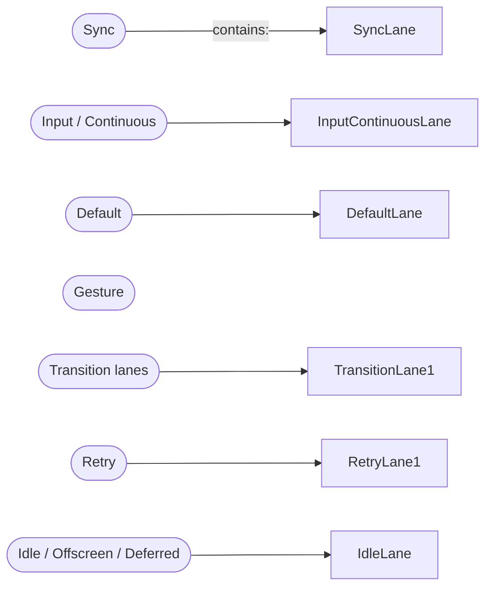
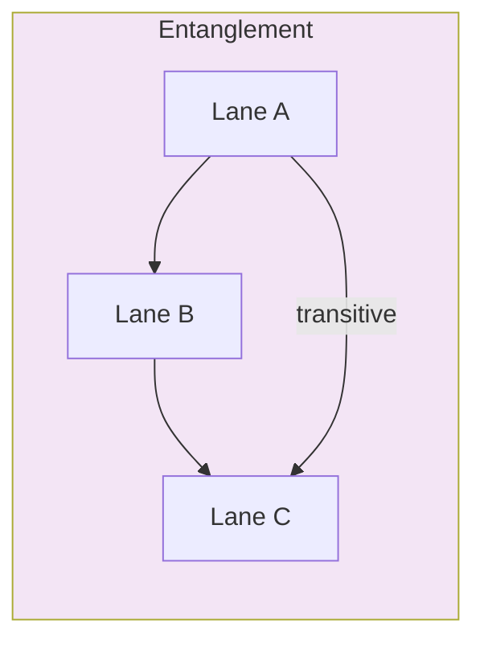

# React Fiber Lane Architecture

This doc describes React's "Lane" scheduling mechanism used by the reconciler to implement concurrent rendering in React 18+. It explains the lane model, the key algorithmic operations (selection, interruption, entanglement, expiration), and references to the canonical code.

> For implementation details, consult `packages/react-reconciler/src/ReactFiberLane.js` and the scheduler/workloop files:
> - `ReactFiberWorkLoop.js`
> - `ReactFiberRootScheduler.js`
> - `ReactFiberAsyncAction.js`

---

## TL;DR

- Lanes are a set of priority "channels" (bits in an integer) used to categorize and schedule updates.
- A single `Lane` is a bit; `Lanes` is a bitmask union of many lanes.
- React uses lanes to prioritize and group work (e.g. Sync, Input, Default, Transition, Retry, Idle).
- The scheduling algorithm selects the highest priority unblocked/ready lanes using bit operations and specific heuristics.

---

## Lane Fundamentals

Key types (in `ReactFiberLane.js`):

```js
export type Lanes = number;
export type Lane = number;
export type LaneMap<T> = Array<T>;
```

Implementation details:
- React uses 31 lanes (bits) in a 32-bit integer, called `TotalLanes = 31`.
- `NoLane` / `NoLanes` = `0b0` means no work.
- Each lane is a single bit (e.g. `SyncLane = 0b10`, `DefaultLane = 0b100000`) and named constants are defined in `ReactFiberLane.js`.

---

## Core Lane Groups (bit layout)

- Sync lanes (highest): `SyncHydrationLane`, `SyncLane`.
- Input / continuous: `InputContinuousHydrationLane`, `InputContinuousLane`.
- Default: `DefaultHydrationLane`, `DefaultLane`.
- Gesture: `GestureLane`.
- Transition lanes: `TransitionUpdateLanes` + `TransitionDeferredLanes` (14 lanes total, split between immediate & deferred).
- Retry lanes (for Suspense retry): `RetryLane1-4`.
- Selective hydration and Idle lanes (lowest priority): `SelectiveHydrationLane`, `IdleHydrationLane`, `IdleLane`, `OffscreenLane`, `DeferredLane`.

A small diagram (grouped, not exact bit positions):



---

## Why a bitmask? (Benefits)

- Fast union / intersection / membership checks with bitwise operators.
- Compact representation of multiple simultaneous priorities.
- Enables efficient heuristics to pick a single (highest-priority) lane using `lanes & -lanes` to pick the lowest set bit.

---

## Key API / Utility Functions

- getHighestPriorityLane(lanes): returns the highest priority lane as the lowest set bit: `lanes & -lanes`.
- getHighestPriorityLanes(lanes): returns a group of lanes that share the same priority group (e.g. Sync, Default, Transition, Idle group) based on the highest lane present.
- getNextLanes(root, wipLanes, rootHasPendingCommit): determines the lanes to render next, considering pending lanes, suspended lanes, pinged lanes, warm/prewarmed lanes, and entanglement.
- pickArbitraryLane(lanes): returns a lane from a set (usually the highest priority lane) — used when any lane of that set is OK to assign to an update.
- mergeLanes(a,b), removeLanes(set, subset), intersectLanes(a, b): standard bitwise helpers.
- includes* functions: quick checks for whether lanes contain certain groups (Sync, Transition, Idle, Retry, etc.).

Important code references: `ReactFiberLane.js` implements these helpers; see `getHighestPriorityLanes`, `getNextLanes`, and the `includes*` helpers.

---

## Core Scheduling Algorithm (getNextLanes)

`getNextLanes` is the core function the scheduler uses to choose the next work to render. It follows these steps generally:

1. Bail out if there's no pending work.
2. Prefer non-idle work (only render idle when there's no non-idle work).
3. From pending lanes, check the unblocked lanes (not suspended) — these are eligible to work on.
4. If none are unblocked, check `pingedLanes` (lanes that were resumed after a previously blocked state).
5. If none are ready, look for lanes that need prewarming (a pre-commit attempt) and select the highest priority of those.
6. Avoid interrupting an in-progress render unless the incoming lanes have strictly higher priority than the current work. Transition lanes are special: default updates should not interrupt transitions.

Mermaid flowchart:

```mermaid
flowchart TD
    A[getNextLanes(root)] --> B{pendingLanes === NoLanes}
    B -->|Yes| C[NoLanes]
    B -->|No| D[Compute nonIdlePendingLanes]
    D --> E{nonIdlePendingLanes !== NoLanes}
    E -->|Yes| F[nonIdleUnblocked = & ~suspended]
    F --> G{nonIdleUnblocked !== NoLanes}
    G -->|Yes| H[getHighestPriorityLanes(nonIdleUnblocked)]
    G -->|No| I[nonIdlePinged = & pingedLanes]
    I --> J{nonIdlePinged !== NoLanes}
    J -->|Yes| K[getHighestPriorityLanes(nonIdlePinged)]
    J -->|No| L[Prewarm or fallback] 
    E -->|No| M[Handle only idle/Offscreen/Deferred work similarly]

    style H fill:#c8e6c9
    style K fill:#c8e6c9
    style L fill:#fff3e0
    style M fill:#fff3e0
```

---

## Interruption Policy

- If there's an in-progress (wip) root render, React avoids switching lanes mid-render unless the new lanes are strictly higher priority than the current ones.
- Exceptions exist when the current work is suspended (i.e. `wipLanes` is suspended) — then React can switch to a new lane to make progress.
- Default priority updates generally shouldn't interrupt a transition. This prevents transitions from being torn down mid-way by lower priority but newer updates.

Interruption logic snippet (simplified):

```js
if (
  wipLanes !== NoLanes &&
  wipLanes !== nextLanes &&
  (wipLanes & suspendedLanes) === NoLanes
) {
  // determine highest priority lane of both
  if (nextLane >= wipLane || (nextLane === DefaultLane && (wipLane & TransitionLanes))) {
    // keep working on wipLanes
    return wipLanes;
  }
}
```

---

## Entanglement (Grouping Related Updates)

- Entanglement prevents updates that are logically linked (e.g. created by the same async action or the same transition) from being executed in separate renders. When one entangled lane is included, all entangled lanes should be included.
- Entanglements are tracked per root using `root.entanglements` and `root.entangledLanes`.
- Entanglements are transitive: if A entangled with B, and B with C, then A is entangled with C.

Key logic is `getEntangledLanes(root, renderLanes)` which returns a lane union that includes transitively entangled lanes.

Mermaid diagram for entanglement:



---

## Expiration & Starving Prevention

- Low-priority lanes can "starve" if higher-priority updates keep coming. To prevent perpetual starvation, an expiration timer is associated with lanes.
- `computeExpirationTime(lane, now)` assigns expiration times based on the lane priority group.
- `markStarvedLanesAsExpired(root, currentTime)` scans pending lanes and marks those whose expiration times have passed into `root.expiredLanes`.
- Expired lanes are treated as finished for scheduling (they gain higher priority effectively).

Snippet:

```js
if (expirationTime <= currentTime) {
  root.expiredLanes |= lane;
}
```

---

## Transitions / Retry / Deferred Lanes

- Transitions: `claimNextTransitionUpdateLane()` is used when a transition starts, cycling through transition lanes (so concurrent transitions often get unique lanes).
- Deferred lanes: `claimNextTransitionDeferredLane()` for deferred transitions (like `startTransition` + defer).
- Retry lanes: `claimNextRetryLane()` creates retry lanes for suspense. Retry lanes have special handling with `RetryLanes` and `markRootFinished` logic.

---

## Useful functions & constants to inspect

- `ReactFiberLane.js`
  - Constants: `SyncLane`, `InputContinuousLane`, `DefaultLane`, `TransitionLane1-14`, `RetryLane1-4`, `IdleLane`, `OffscreenLane`, `DeferredLane`.
  - Utility functions: `getNextLanes`, `getHighestPriorityLanes`, `getEntangledLanes`, `mergeLanes`, `removeLanes`, `pickArbitraryLane`.
  - Entanglement: `markRootEntangled`, `markSpawnedDeferredLane`.
  - Expiration: `computeExpirationTime`, `markStarvedLanesAsExpired`.

- `ReactFiberWorkLoop.js` and `ReactFiberRootScheduler.js` — actual code paths where `getNextLanes` and scheduling logic are invoked.
- `ReactFiberAsyncAction.js` — shows the entanglement semantics for async actions.
- `ReactEventPriorities.js` — functions `eventPriorityToLane` and `lanesToEventPriority` which map between lane bitmasks and external event priorities.

---

## Examples

- Start Transition: `requestTransitionLane()` / `claimNextTransitionUpdateLane()` assigns a transition lane from pool.
- Update scheduling: calling `markRootUpdated(root, updateLane)` OR a dispatch update sets `root.pendingLanes |= updateLane`.
- When root is suspended during render: `markRootSuspended(root, suspendedLanes, spawnedLane, didAttemptEntireTree)` marks lanes as suspended and clears timeouts for those lanes.

---

## Devtools & Lanes

- React DevTools uses lane labels and maps lane bitmasks to friendly names via the function `getLabelForLane` in `ReactFiberLane.js`.
- `Reactive profiling` tools in React use `laneToLabelMap` to visualize lanes.

---

## Further reading & tests

- Tests that verify entanglement and transitions: `packages/react-reconciler/src/__tests__/ReactTransition-test.js` and `ReactAsyncActions-test.js`.
- The scheduling path that uses lanes is implemented across: `ReactFiberWorkLoop.js`, `ReactFiberRootScheduler.js`, `ReactFiberCommitWork.js`.

---

## Cheatsheet

- To pick highest priority lane: `getHighestPriorityLane(lanes)` -> `lanes & -lanes`.
- To merge lanes: `mergeLanes(a,b)` -> `a|b`.
- To test membership: `includesSomeLane(a,b)` -> `(a & b) !== NoLanes`.
- To add a pending update: `markRootUpdated(root, lane)` -> `root.pendingLanes |= lane;`.

---

If you'd like, I can expand this into a richer visual guide (sequence diagrams for transitions entanglements or explicit example traces for multiple concurrent updates), or link to specific code lines for a precise deep-dive. Let me know which part you'd like to explore next!