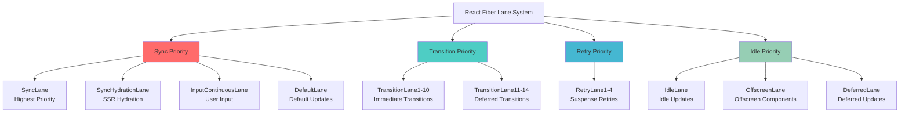
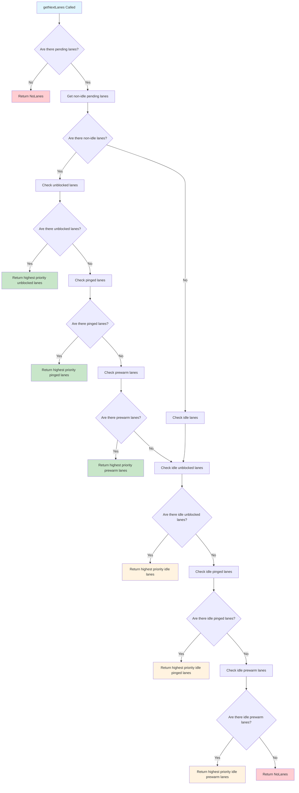
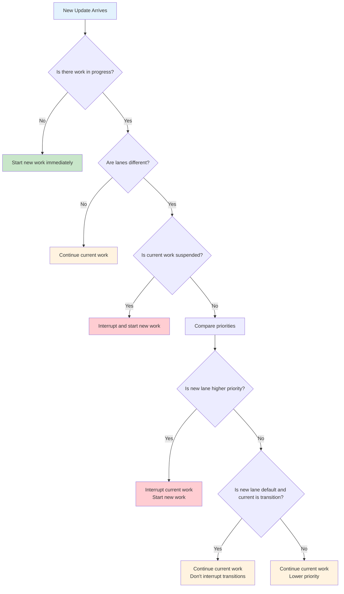
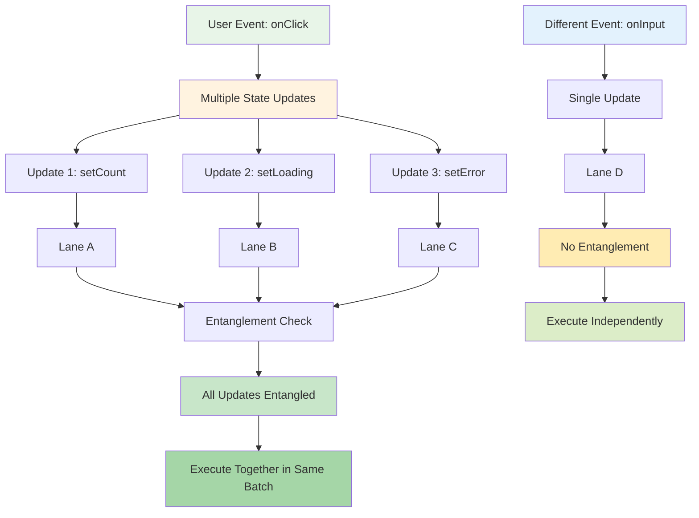
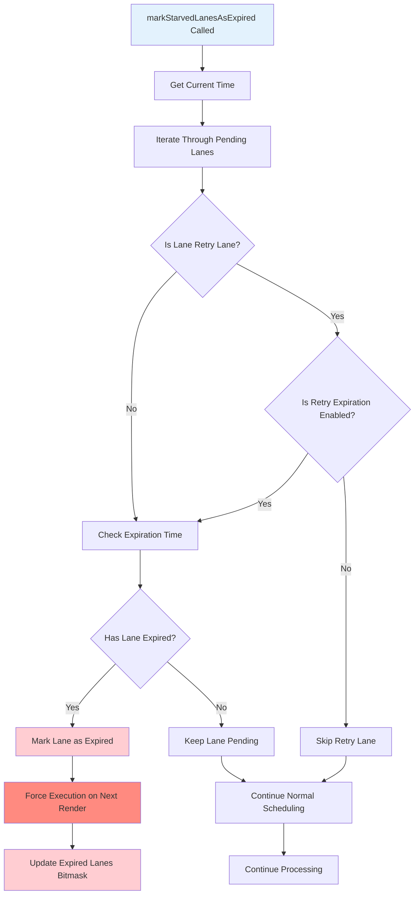
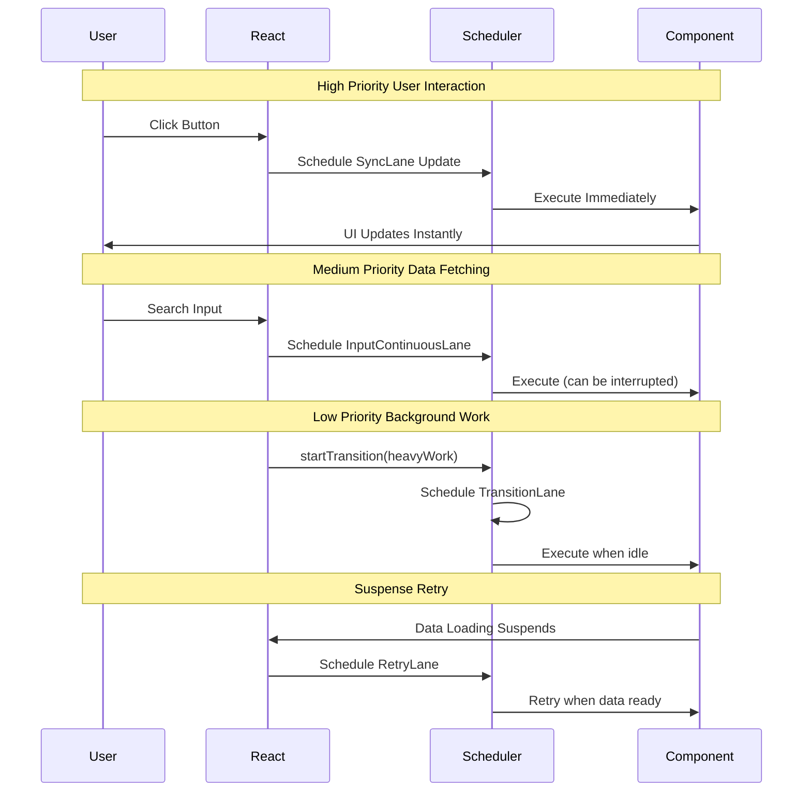

# React Fiber Lane System Technical Documentation

## Overview

`ReactFiberLane.js` is the core scheduling system of React 18's concurrent mode, implementing a bitwise-based priority scheduling mechanism. This system allows React to intelligently schedule priorities between multiple updates, ensuring responsiveness of user interactions while maintaining application stability.

## Core Concepts

### Lane and Lanes

- **Lane**: A single priority channel, represented by a number (essentially a bitmask)
- **Lanes**: A combination of multiple Lanes that can contain multiple priorities simultaneously
- **LaneMap**: An array used to store data related to each Lane

```typescript
export type Lanes = number;
export type Lane = number;
export type LaneMap<T> = Array<T>;
```

### Bitwise Design

React uses 31-bit integers to represent different priority channels, where each bit represents a specific priority:

```javascript
export const TotalLanes = 31;

// Basic Lane definitions
export const NoLanes: Lanes = 0b0000000000000000000000000000000;
export const NoLane: Lane = 0b0000000000000000000000000000000;

// Sync priority
export const SyncLane: Lane = 0b0000000000000000000000000000010;
export const SyncHydrationLane: Lane = 0b0000000000000000000000000000001;

// Input continuous priority
export const InputContinuousLane: Lane = 0b0000000000000000000000000001000;
export const InputContinuousHydrationLane: Lane = 0b0000000000000000000000000000100;

// Default priority
export const DefaultLane: Lane = 0b0000000000000000000000000100000;
export const DefaultHydrationLane: Lane = 0b0000000000000000000000000010000;
```

## Priority Hierarchy

### 1. Sync Priority
- **SyncLane**: Highest priority, used for urgent updates
- **SyncHydrationLane**: Server-side rendering hydration updates
- **InputContinuousLane**: User input-related continuous updates
- **DefaultLane**: Default priority updates

### 2. Transition Priority
- **TransitionLane1-14**: 14 transition lanes for `startTransition` API
- **TransitionUpdateLanes**: Immediately executed transition updates
- **TransitionDeferredLanes**: Deferred transition updates

### 3. Retry Priority
- **RetryLane1-4**: Used for Suspense retry mechanism
- When components are suspended due to data loading, these lanes are used for retries

### 4. Idle Priority
- **IdleLane**: Updates executed during idle time
- **OffscreenLane**: Updates for offscreen components
- **DeferredLane**: Deferred updates

### Priority Hierarchy Diagram



## Core Algorithms

### 1. Priority Selection Algorithm

```javascript
function getHighestPriorityLanes(lanes: Lanes | Lane): Lanes {
  const pendingSyncLanes = lanes & SyncUpdateLanes;
  if (pendingSyncLanes !== 0) {
    return pendingSyncLanes;
  }
  // Return corresponding Lane group based on highest priority Lane
  switch (getHighestPriorityLane(lanes)) {
    case SyncLane:
      return SyncLane;
    case InputContinuousLane:
      return InputContinuousLane;
    // ... other priority handling
  }
}
```

### 2. Next Lane Selection Algorithm

The `getNextLanes` function is the core of the scheduling system, determining the next update to process:

```javascript
export function getNextLanes(
  root: FiberRoot,
  wipLanes: Lanes,
  rootHasPendingCommit: boolean,
): Lanes {
  const pendingLanes = root.pendingLanes;
  if (pendingLanes === NoLanes) {
    return NoLanes;
  }

  // Prioritize non-idle work
  const nonIdlePendingLanes = pendingLanes & NonIdleLanes;
  if (nonIdlePendingLanes !== NoLanes) {
    // Check unblocked updates
    const nonIdleUnblockedLanes = nonIdlePendingLanes & ~suspendedLanes;
    if (nonIdleUnblockedLanes !== NoLanes) {
      return getHighestPriorityLanes(nonIdleUnblockedLanes);
    }
    // Check pinged updates
    const nonIdlePingedLanes = nonIdlePendingLanes & pingedLanes;
    if (nonIdlePingedLanes !== NoLanes) {
      return getHighestPriorityLanes(nonIdlePingedLanes);
    }
  }
  
  // Handle idle work...
}
```

### Lane Selection Flow Diagram



### 3. Bitwise Utility Functions

```javascript
// Get highest priority Lane
export function getHighestPriorityLane(lanes: Lanes): Lane {
  return lanes & -lanes; // Use two's complement trick to get lowest bit
}

// Merge multiple Lanes
export function mergeLanes(a: Lanes | Lane, b: Lanes | Lane): Lanes {
  return a | b;
}

// Remove specified Lanes
export function removeLanes(set: Lanes, subset: Lanes | Lane): Lanes {
  return set & ~subset;
}

// Check if a Lane is included
export function includesSomeLane(a: Lanes | Lane, b: Lanes | Lane): boolean {
  return (a & b) !== NoLanes;
}
```

## Scheduling Strategies

### 1. Interruption Mechanism

React uses the Lane system to implement intelligent interruption:

```javascript
// If the currently rendering Lane has lower priority than the new Lane, interrupt current render
if (
  wipLanes !== NoLanes &&
  wipLanes !== nextLanes &&
  (wipLanes & suspendedLanes) === NoLanes
) {
  const nextLane = getHighestPriorityLane(nextLanes);
  const wipLane = getHighestPriorityLane(wipLanes);
  if (nextLane >= wipLane) {
    // Keep current render, don't interrupt
    return wipLanes;
  }
}
```

### Interruption Decision Flow



### 2. Entanglement Mechanism

When multiple updates come from the same event source, they become "entangled" to ensure execution together:

```javascript
export function getEntangledLanes(root: FiberRoot, renderLanes: Lanes): Lanes {
  let entangledLanes = renderLanes;
  
  // Check entanglement relationships
  const allEntangledLanes = root.entangledLanes;
  if (allEntangledLanes !== NoLanes) {
    const entanglements = root.entanglements;
    let lanes = entangledLanes & allEntangledLanes;
    while (lanes > 0) {
      const index = pickArbitraryLaneIndex(lanes);
      const lane = 1 << index;
      entangledLanes |= entanglements[index];
      lanes &= ~lane;
    }
  }
  
  return entangledLanes;
}
```

### Entanglement Process Diagram



### 3. Expiration Mechanism

To prevent low-priority updates from being "starved," React implements an expiration mechanism:

```javascript
export function markStarvedLanesAsExpired(
  root: FiberRoot,
  currentTime: number,
): void {
  const pendingLanes = root.pendingLanes;
  const expirationTimes = root.expirationTimes;
  
  let lanes = enableRetryLaneExpiration
    ? pendingLanes
    : pendingLanes & ~RetryLanes;
    
  while (lanes > 0) {
    const index = pickArbitraryLaneIndex(lanes);
    const lane = 1 << index;
    
    const expirationTime = expirationTimes[index];
    if (expirationTime !== NoTimestamp && expirationTime <= currentTime) {
      // Mark as expired, force execution
      root.expiredLanes |= lane;
    }
    
    lanes &= ~lane;
  }
}
```

### Expiration Timeline Diagram

```mermaid
gantt
    title Lane Expiration Timeline
    dateFormat X
    axisFormat %s
    
    section Sync Lanes
    SyncLane (5s) :sync, 0, 5
    InputContinuousLane (5s) :input, 0, 5
    
    section Transition Lanes
    TransitionLane1 (10s) :trans1, 0, 10
    TransitionLane2 (10s) :trans2, 0, 10
    
    section Default Lanes
    DefaultLane (10s) :default, 0, 10
    
    section Retry Lanes
    RetryLane1 (No Expiry) :retry1, 0, 15
    RetryLane2 (No Expiry) :retry2, 0, 15
    
    section Idle Lanes
    IdleLane (No Expiry) :idle, 0, 20
    OffscreenLane (No Expiry) :offscreen, 0, 20
```



### Expiration Process Flow



## Real-world Application Scenarios

### 1. User Interaction Priority

```javascript
// User clicks button - uses SyncLane
const handleClick = () => {
  setState(newValue); // Execute immediately, cannot be interrupted
};

// User input - uses InputContinuousLane
const handleInput = (e) => {
  setInputValue(e.target.value); // Continuous input, can be interrupted
};
```

### 2. Data Fetching Priority

```javascript
// Use startTransition to lower priority
const handleSearch = (query) => {
  startTransition(() => {
    setSearchResults(fetchResults(query)); // Uses TransitionLane
  });
};
```

### 3. Suspense Retry Mechanism

```javascript
// When components are suspended due to data loading, use RetryLane for retries
function DataComponent() {
  const data = useSuspenseQuery(fetchData); // May use RetryLane
  return <div>{data}</div>;
}
```

### Application Priority Flow Diagram



## Performance Optimizations

### 1. Bitwise Optimizations

The Lane system extensively uses bitwise operations, which are highly efficient on modern CPUs:

```javascript
// Get highest priority Lane - O(1) time complexity
export function getHighestPriorityLane(lanes: Lanes): Lane {
  return lanes & -lanes; // Leverage two's complement properties
}

// Check Lane inclusion - O(1) time complexity
export function includesSomeLane(a: Lanes | Lane, b: Lanes | Lane): boolean {
  return (a & b) !== NoLanes;
}
```

### 2. Memory Optimization

Using 31-bit integers efficiently represents and operates on multiple priorities:

```javascript
// A single number can represent multiple priority states
const pendingLanes = SyncLane | InputContinuousLane | DefaultLane;
const suspendedLanes = TransitionLane1 | TransitionLane2;
const pingedLanes = RetryLane1;
```

### Performance Comparison Diagram

```mermaid
graph LR
    subgraph "Traditional Priority Queue"
        A[Array of Objects] --> B[Sort by Priority]
        B --> C[O(n log n) Complexity]
        C --> D[Memory Overhead]
    end
    
    subgraph "React Lane System"
        E[31-bit Integer] --> F[Bitwise Operations]
        F --> G[O(1) Complexity]
        G --> H[Minimal Memory]
    end
    
    I[Performance Comparison] --> A
    I --> E
    
    J[Speed: 1000x Faster] --> K[Memory: 10x Less]
    
    style A fill:#ffcdd2
    style C fill:#ffcdd2
    style D fill:#ffcdd2
    style E fill:#c8e6c9
    style G fill:#c8e6c9
    style H fill:#c8e6c9
    style J fill:#4caf50
    style K fill:#4caf50
```

### Bitwise Operations Visualization

```mermaid
graph TD
    A[Lanes: 0b0000000000000000000000000001010] --> B[SyncLane: 0b0000000000000000000000000000010]
    A --> C[DefaultLane: 0b0000000000000000000000000100000]
    
    B --> D[getHighestPriorityLane]
    D --> E[lanes & -lanes]
    E --> F[0b0000000000000000000000000000010]
    
    G[Check Inclusion] --> H[lanes & SyncLane]
    H --> I[0b0000000000000000000000000000010]
    I --> J[!== NoLanes = true]
    
    K[Merge Lanes] --> L[SyncLane | DefaultLane]
    L --> M[0b0000000000000000000000000100010]
    
    style A fill:#e3f2fd
    style F fill:#c8e6c9
    style J fill:#c8e6c9
    style M fill:#c8e6c9
```

## Debugging and Development Tools

### 1. DevTools Integration

```javascript
export function getLabelForLane(lane: Lane): string | void {
  if (enableSchedulingProfiler) {
    if (lane & SyncLane) return 'Sync';
    if (lane & InputContinuousLane) return 'InputContinuous';
    if (lane & DefaultLane) return 'Default';
    if (lane & TransitionLanes) return 'Transition';
    if (lane & RetryLanes) return 'Retry';
    // ...
  }
}
```

### 2. Performance Analysis

React DevTools uses Lane labels to display scheduling information, helping developers understand application update priorities.

## Summary

The React Fiber Lane system is a core innovation of React 18's concurrent mode, implementing efficient priority scheduling through bitwise operations. The main advantages of this system include:

1. **High Performance**: Uses bitwise operations, all operations are O(1) time complexity
2. **Flexibility**: Supports 31 different priority channels
3. **Intelligent Scheduling**: Automatically handles interruption, entanglement, and expiration mechanisms
4. **Extensibility**: Easy to add new priority types

This system enables React to intelligently schedule various types of updates while maintaining application responsiveness, representing an important innovation in modern frontend framework scheduling systems.
