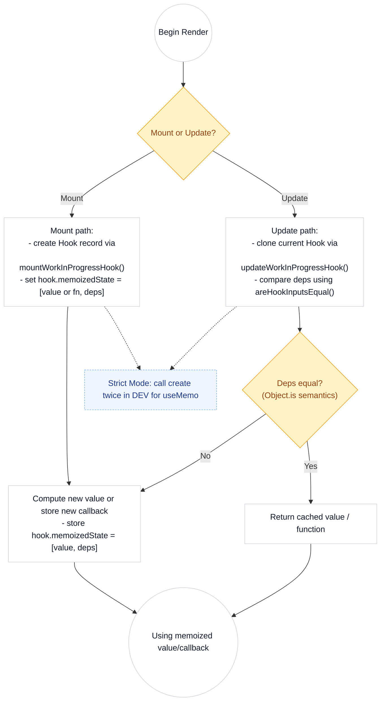

# useMemo & useCallback — Source-Level Explanation

This document explains how `useMemo` and `useCallback` behave and are implemented in React’s source (the reconciler). It describes the mount and update flows, how React stores memoized values, dependency comparisons, and a few important dev-mode behaviors. A simple mermaid flowchart shows the core lifecycle.

---

## 🔎 Quick Overview

- Both `useMemo` and `useCallback` are implemented in the reconciler (see `packages/react-reconciler/src/ReactFiberHooks.js`).
- `useCallback(fn, deps)` is a thin wrapper over `useMemo(() => fn, deps)` — the semantics are identical with respect to memoization and deps checking.
- React stores hook state in a linked list of Hook objects on the Fiber's `memoizedState` (each Hook is an object with fields like `memoizedState`, `queue`, `next`, etc.).
- For `useMemo` and `useCallback`, `hook.memoizedState` is an array `[value, deps]` where `value` is either the memoized value (`useMemo`) or the function for `useCallback`.
- Dependency comparison uses `areHookInputsEqual` (in `ReactFiberHooks.js`) which uses `Object.is` semantics (via `shared/objectIs`), *not deep equality*.

---

## 📌 File-level source references (code locations)

- Hook system and implementations: `packages/react-reconciler/src/ReactFiberHooks.js`.
  - `mountCallback` / `updateCallback` (callbacks): located in `ReactFiberHooks.js`.
  - `mountMemo` / `updateMemo` (values): located in `ReactFiberHooks.js`.
  - `mountWorkInProgressHook` / `updateWorkInProgressHook`: hook list creation and cloning.
  - `areHookInputsEqual`: dependency check using `Object.is` semantics.
- Dispatcher mapping: `HooksDispatcherOnMount` and `HooksDispatcherOnUpdate` map `useMemo`/`useCallback` to their mount/update implementations.

---

## 🧭 Mount vs Update — How React stores/compares data (source-level steps)

- When a component renders, React sets the dispatcher based on whether the component is in its initial (mount) render or an update:
  - `HooksDispatcherOnMount` -> mount functions (`mountMemo`, `mountCallback`, etc.)
  - `HooksDispatcherOnUpdate` -> update functions (`updateMemo`, `updateCallback`, etc.)

- Mount path (first render):
  1. Call `mountWorkInProgressHook()` to create a `Hook` object (linked list appended to the fiber's `memoizedState`).
  2. For `useMemo`: call the `create` callback (the creation function), store the computed value and deps in `hook.memoizedState` as `[nextValue, nextDeps]`, and return the value.
  3. For `useCallback`: store `[callback, nextDeps]` in `hook.memoizedState` and return `callback`.

- Update path (subsequent renders):
  1. React calls `updateWorkInProgressHook()` which clones or reuses the matching `Hook` from the previous `current` fiber.
  2. For both hooks: React computes `nextDeps` (array or null) and retrieves `prevDeps` from `prevHook.memoizedState[1]`.
  3. `areHookInputsEqual(nextDeps, prevDeps)` checks equality (per-element `Object.is` semantics). If equal: return cached `prevState[0]`.
  4. If not equal: `useMemo` reevaluates `nextCreate()` to compute the new value, `useCallback` stores the new function, and `hook.memoizedState` is updated to `[valueOrCallback, nextDeps]`.

---

## ✅ Example of the core implementation (stripped/annotated)

Note: This is simplified and trimmed for readability — see `ReactFiberHooks.js` for full code.

mountCallback (conceptual):

```js
function mountCallback(callback, deps) {
  const hook = mountWorkInProgressHook();
  const nextDeps = deps === undefined ? null : deps;
  hook.memoizedState = [callback, nextDeps];
  return callback;
}
```

updateCallback (conceptual):

```js
function updateCallback(callback, deps) {
  const hook = updateWorkInProgressHook();
  const nextDeps = deps === undefined ? null : deps;
  const prevState = hook.memoizedState; // [prevCallback, prevDeps]
  if (nextDeps !== null) {
    const prevDeps = prevState[1];
    if (areHookInputsEqual(nextDeps, prevDeps)) {
      return prevState[0]; // return cached function
    }
  }
  hook.memoizedState = [callback, nextDeps];
  return callback;
}
```

mountMemo (conceptual):

```js
function mountMemo(nextCreate, deps) {
  const hook = mountWorkInProgressHook();
  const nextDeps = deps === undefined ? null : deps;
  const nextValue = nextCreate();
  hook.memoizedState = [nextValue, nextDeps];
  return nextValue;
}
```

updateMemo (conceptual):

```js
function updateMemo(nextCreate, deps) {
  const hook = updateWorkInProgressHook();
  const nextDeps = deps === undefined ? null : deps;
  const prevState = hook.memoizedState; // [prevVal, prevDeps]
  if (nextDeps !== null) {
    const prevDeps = prevState[1];
    if (areHookInputsEqual(nextDeps, prevDeps)) {
      return prevState[0]; // return memoized value
    }
  }
  const nextValue = nextCreate();
  hook.memoizedState = [nextValue, nextDeps];
  return nextValue;
}
```

---

## 🧪 Development behavior (DEV-mode / Strict Mode details)

- In DEV & Strict Mode, React may double-invoke the `nextCreate` function passed to `useMemo`. This is controlled by `shouldDoubleInvokeUserFnsInHooksDEV`, and you can see checks for it in `ReactFiberHooks.js` (the file calls `nextCreate()` twice to help detect impure functions and side effects).
- The dev-only helper `areHookInputsEqual` prints warnings if you change the existence or the length of the deps array between renders, or if you omit deps on some renders and pass a deps array on others.
- For hot reload scenarios, React may temporarily set `ignorePreviousDependencies` (which will make `areHookInputsEqual` always return false), resulting in the hook being considered a fresh mount for dependency checks.

---

## 💡 Diagram: The Hook Lifecycle & Where `useMemo`/`useCallback` Fit

A flowchart describing the mount/update flow for both `useMemo` & `useCallback`. The flow is intentionally simple and uses muted colors.



---

## 🔑 Key Points (Diagram-friendly & succinct)

- Simple architecture: both hooks store their memoized state as `[value, deps]` in `Hook.memoizedState` on the fiber.
- Mount vs Update: `mount*` creates the Hook, `update*` clones/reads the existing Hook and relies on deps comparison.
- Dependency check: `areHookInputsEqual` uses `Object.is` semantics per element.
- `useCallback(fn, deps)` is syntactic shorthand for `useMemo(() => fn, deps)`; they behave the same regarding deps and storage.
- Dev-mode behaviors (Strict Mode double-invoke, related checks, warning for inconsistent deps arrays) are in `ReactFiberHooks.js`.
- Over-reliance on these hooks can be counterproductive; they are performance heuristics, not correctness tools.

---

## 🧾 Quick Reference Links (within repo)

- `ReactFiberHooks.js`: packages/react-reconciler/src/ReactFiberHooks.js
  - `mountWorkInProgressHook` / `updateWorkInProgressHook` (hook list and clone)
  - `mountCallback` / `updateCallback`
  - `mountMemo` / `updateMemo`
  - `areHookInputsEqual`
- `ReactFiberBeginWork.js`: packages/react-reconciler/src/ReactFiberBeginWork.js (calls `renderWithHooks`, establishes mount/update dispatchers)

---

If you'd like, I can:
- Add a more detailed sequence diagram (e.g., per call stack with `renderWithHooks`, dispatcher, etc.),
- Link exact line numbers and snippet anchors in the doc to the repo (line tags), or
- Incorporate ESLint + runtime examples that show when each branch runs in Strict Mode.

Let me know which of these you'd prefer next! ✅
