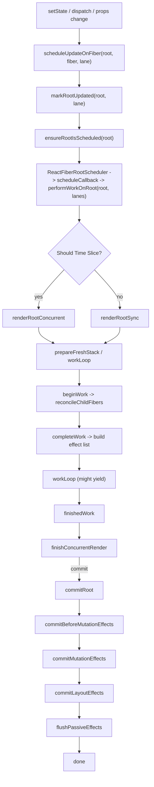

# React — Rerender Architecture & Flow

This document explains React's rerender architecture and flow at a high level and provides details about the functions and files involved in scheduling, rendering, and committing updates.

This file is intended for engineers who want a clear reference for how React's reconciler organizes work (fibers, lanes, work-in-progress), handles priorities (lanes), and commits DOM updates in a way that allows interruption and resumption (concurrent rendering).

---

## 1. Summary

- Updating a React tree involves four phases: trigger, schedule, render (build WIP), and commit (apply changes).
- React separates the render phase (pure computation) from the commit phase (host mutations). This separation enables time-slicing and interruption (concurrency).
- Lanes (bitmask priorities) and the scheduler determine which update work should run and when it may preempt lower-priority work.

---

## 2. Key Concepts

- Fiber: React's data structure for a component, containing props, state, children, update queue, and flags.
- Work-in-Progress (WIP): A temporary tree built during render to compute the next state of the UI without mutating the host.
- Lanes (Priorities): A bitmask system used to represent update priorities (Sync, Default, Transition, Retry, Idle, etc.).
- Effect list & flags: The render phase sets flags (Placement, Update, Deletion, Passive, Layout), then commit processes those effects.
- Scheduler: The `scheduler` package controls scheduling and yielding to keep the main thread responsive.

---

## 3. End-to-end Flow (High-Level)

1. Trigger: setState / dispatch / props changes call `scheduleUpdateOnFiber`.
2. Schedule: `scheduleUpdateOnFiber` marks `root.pendingLanes` via `markRootUpdated` and ensures the root is scheduled using `ensureRootIsScheduled` (root scheduler decides when to run `performWorkOnRoot`).
3. Render: `performWorkOnRoot` chooses between `renderRootConcurrent` and `renderRootSync`. The render builds a work-in-progress (WIP) tree by running `beginWork` and `completeWork` and collects effects.
4. Commit: `commitRoot` flushes any pending passive effects, runs before-mutation effects (`getSnapshotBeforeUpdate`), performs mutation effects (DOM ops), runs layout effects, and finally queues passive effects for later.

---

## 4. Typical Function Flow (Key Functions & Files)

- Root scheduling and prioritization:
  - `packages/react-reconciler/src/ReactFiberRootScheduler.js` — root queueing and scheduling; picks lanes to work on with `getNextLanes`.
  - `packages/react-reconciler/src/ReactFiberLane.js` — lane bitmasks and lane utilities.
- Work loop and render:
  - `packages/react-reconciler/src/ReactFiberWorkLoop.js` — `performWorkOnRoot`, `renderRootSync`, `renderRootConcurrent`, and commit logic.
  - `packages/react-reconciler/src/ReactFiberBeginWork.js` — `beginWork`, which renders elements and reconciles children.
  - `packages/react-reconciler/src/ReactFiberCompleteWork.js` — `completeWork`, which prepares host nodes and creates effect list entries.
- Commit and layout:
  - `packages/react-reconciler/src/ReactFiberCommitWork.js` — commit-phase traversal and host mutation helpers (`commitPlacement`, `commitDeletion`, `commitUpdate`).
  - `packages/react-reconciler/src/ReactFiberCommitEffects.js` — effect evaluation and ordering helpers.

---

## 5. Concurrency Essentials

- Interruption: `workLoopConcurrent` calls `shouldYield` to decide whether to yield back to the scheduler. WIP trees are preserved for later resumption.
- Preemption: Higher-priority lanes can preempt lower-priority lanes. The scheduler re-evaluates lanes using `getNextLanes`.
- Suspense: When a component 'throws' a Promise during rendering, React marks that fiber as suspended. The renderer may show fallbacks, delay commits, or retry the render when the Promise resolves (ping).
- Transitions: `startTransition` marks updates as transition lanes — React schedules them with lower priority so urgent UI updates remain responsive.

---

## 6. Commit Phases (Short Sequence)

1. Passive tasks flush (previous effects via `flushPendingEffects` if needed).
2. `commitBeforeMutationEffects` — getSnapshotBeforeUpdate and other lifecycle snapshots run.
3. `commitMutationEffects` — host mutations are applied (DOM updates, placements, deletions).
4. `root.current` is updated to point at the committed tree.
5. `commitLayoutEffects` — run layout effects (synchronous useLayoutEffect / class lifecycle methods) immediately.
6. Passive effects are queued for asynchronous `useEffect` invocation.

---

## 7. Implementation Notes & Best Practices

- Keep render phase pure — do not mutate host resources in `render`.
- Use `startTransition` for non-urgent updates to avoid blocking interactive UI.
- Keep heavy synchronous updates to a minimum; prefer smaller state updates batched with lanes and transitions.
- Understanding lanes helps debugging scheduling-related visual glitches and re-render ordering.

---

## 8. Mermaid Diagram (Visualizing the Flow)

---

## 9. Quick FAQ

- Q: Why does React separate the render and commit phases?
  - A: To allow interruption, preemption, and re-rendering without mutating the host. This preserves consistency and gives opportunities to yield to the main thread.

- Q: What are lanes and why do they matter?
  - A: Lanes are a priority map. They let React coordinate which updates run first and allow higher priority updates to preempt others.

- Q: How does Suspense affect the rerender flow?
  - A: Suspense suspends part of the render, which can be retried on ping. React may commit fallback content earlier or wait for the promised data to resolve.

---

## 10. References (Key Files)

- `packages/react-reconciler/src/ReactFiberWorkLoop.js`
- `packages/react-reconciler/src/ReactFiberRootScheduler.js`
- `packages/react-reconciler/src/ReactFiberLane.js`
- `packages/react-reconciler/src/ReactFiberBeginWork.js`
- `packages/react-reconciler/src/ReactFiberCompleteWork.js`
- `packages/react-reconciler/src/ReactFiberCommitWork.js`
- `packages/react-reconciler/src/ReactFiberCommitEffects.js`

---

If you'd like, I can also:

- Add a timeline diagram that clarifies lane scheduling & preemption scenarios.
- Include function signatures and small code snippets for `startTransition` / `scheduleUpdateOnFiber` / `commitRoot`.
- Convert the mermaid diagram to an inline SVG for presentations.

If you want changes or a different level of detail (e.g. a step-by-step trace of a specific update from `dispatch` to commit), tell me which scenario you'd like to focus on.
